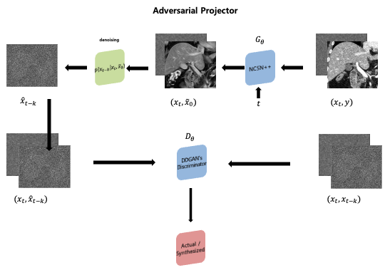
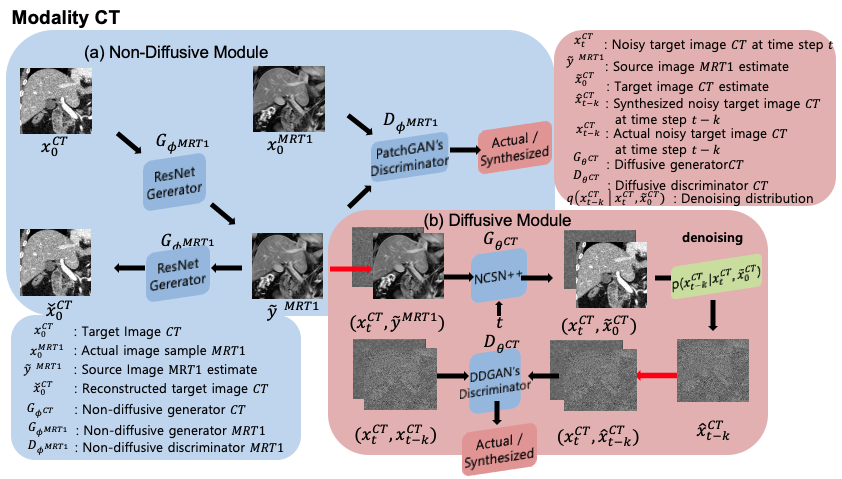

# Bi-Directional Enhancement of Medical Images using MRI-T1 and CT Data:An Adversarial Diffusion Approach

<figure>
    
    <figcaption>Medical Image Generative Quadrilemma</figcaption>
</figure>

## Abstract
Medical image translation is crucial in the medical field to ensure diagnostic accuracy. Multi-modal imaging offers profound insights into anatomical research, enhancing the precision of diagnoses. Additionally, the complementary tissue information provided by each modality refines the diagnostic results and elevates the effectiveness of subsequent imaging tasks. However, medical image synthesis remains a significant challenge in the medical domain. While using GANs for target image synthesis is common, GAN models generally exhibit limitations in sample fidelity. Diffusion models, on the other hand, effectively capture the intricate structures and patterns of data by decomposing them progressively, leading to more refined image synthesis. The advantages of these diffusion models become particularly critical with complex medical imaging data. In this study, considering the challenge of the generative model known as the generative learning trilemma, we apply it to the field of medical image generation, emphasizing a novel aspect called anatomical fidelity. This leads to the proposal of a new concept, Medical Image Generative Quadrilemma. This study employs SynDiff, a modeling based on the adversarial diffusion model, for enhanced performance in medical image translation. To directly capture the correlation of image distribution, SynDiff utilizes a conditional diffusion process that incrementally maps noise and source images to the target image. For swift and precise image sampling during inference, large diffusion steps are taken with adversarial projections in the reverse diffusion direction. To facilitate training on unpaired datasets, a cycle-consistent architecture has been designed, incorporating both diffusive and non-diffusive modules that bilaterally translate between two modalities. Comprehensive evaluations have been reported on the utility of SynDiff against competing GAN and diffusion models in multi-contrast MRI and MRI-CT translation. SynDiff addresses the medical image generative quadrilemma and is anticipated to bring significant advancements not only in the medical imaging domain but also in other multi-modal imaging fields.

<figure>
    
    <figcaption>Adversarial Diffusion Process</figcaption>
</figure>

## Introduction

In the ever-evolving domain of Computer Vision, Generative Adversarial Networks (GANs) have set significant benchmarks in image generation. However, with the rise of intricate domains like medical imaging, the field has witnessed the emergence of diffusion models, signaling a paradigm shift. SynDiff, a model tailored for medical image synthesis, leverages the strengths of diffusion techniques and aims to address the challenges posed by the Medical Image Generative Quadrilemma.

<figure>
    
    <figcaption>SynDiff Training Process</figcaption>
</figure>

## Key Highlights

- **Generative Adversarial Networks (GANs)**: GANs, comprising of a Generator and a Discriminator, set benchmarks in image generation.
  
- **Challenges in Medical Imaging**: GANs face issues like mode collapse, risking the accuracy of medical images. The Medical Image Generative Quadrilemma introduces anatomical fidelity as a key component in addition to the traditional generative learning trilemma.

- **Rise of Diffusion Models**: Models such as DALL-E, Imagen, and SDXL showcase the strengths of diffusion techniques, capturing intricate data distributions and excelling in grasping diverse aspects of data.

- **Inpainting and Imputation**: Emphasizes restoring missing or damaged sections of images, pivotal in fields like image restoration, art, and scientific research.

- **Multi-modal Translation**: Holds significant importance in medical imaging, promising time and cost savings, and enhancing image quality.

- **SynDiff Model**: This study introduces SynDiff, an adversarial diffusion model tailored for medical image synthesis. SynDiff uses conditional diffusion to produce the desired target image, offering efficiency with a larger step size. It integrates both diffusive and non-diffusive processes and has been extensively tested on multi-contrast MRI-CT translations.

- **Focus on Bile Duct Tissue**: Demonstrating SynDiff's efficacy, the model aims to enhance the visibility of the bile duct in CT scans by leveraging MRI data.

<!-- ## Usage

[Placeholder for usage instructions, installation guidelines, and code examples]

## References

1.  -->

## Train

<br />

```
python3 train.py --image_height 400 --image_width 480 --exp exp_syndiff --num_channels 2 --num_channels_dae 64 --ch_mult 1 1 2 2 4 --num_timesteps 4 --num_res_blocks 2 --batch_size 1 --contrast1 CT --contrast2 MRT1 --num_epoch 100 --ngf 64 --embedding_type positional --use_ema --ema_decay 0.999 --r1_gamma 1. --z_emb_dim 256 --lr_d 1e-4 --lr_g 1.6e-4 --lazy_reg 10 --num_process_per_node 3 --save_content --local_rank 0 --input_path ../dataset/train --output_path ./output_epoch50_gpu4_400x480/for/results --port_num 5000
```

## Test

<br />

```
python3 test.py --image_height 400 --image_width 480 --exp exp_syndiff --num_channels 2 --num_channels_dae 64 --ch_mult 1 1 2 2 4 --num_timesteps 4 --num_res_blocks 2 --batch_size 1 --embedding_type positional  --z_emb_dim 256 --contrast1 CT --contrast2 MRT1 --which_epoch 20 --gpu_chose 4 --input_path ../dataset/train --output_path /output_epoch50_gpu4_400x480/for/results
```


## Author

Han Jang - Korea Institute of Science and Technology, Seoul, South Korea.


## Reference
- https://github.com/icon-lab/SynDiff
- https://arxiv.org/abs/2207.08208
